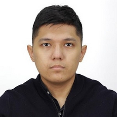

Hi, I'm Sanzhar 👋

# Sanzhar Shakarim

**Project Engineer**  
[Email Me](mailto:shakarim.sanjar@gmail.com) | [LinkedIn](https://www.linkedin.com/in/sanzhar-shakarim-248497205/) | [Telegram](https://t.me/Sanchozver)

---

## About Me

I am a Project Engineer with a strong background in engineering and project management. I have experience in various industries, including transportation, manufacturing, and infrastructure. My expertise lies in managing complex projects, ensuring timely delivery, and optimizing processes to improve efficiency.

I am passionate about leveraging technology and data-driven insights to drive innovation and solve complex challenges. I am a collaborative team player who thrives in dynamic environments, and I am committed to delivering high-quality results that exceed client expectations.

---

## Timeline

- **2019.02 - Astana, Kazakhstan**  
  **HPAIR 2019**  
  Organizing committee member for Harvard College Conference

- **2022.01 - Astana, Kazakhstan**  
  **Samruk Energo**  
  Electrical Engineering Winter Intern

- **2023.11 - Astana, Kazakhstan**  
  **Nazarbayev University**  
  Research Assistant at Dr. Gulsim Kulsharova Lab  
  Published my [paper](https://ieeexplore.ieee.org/document/9881355) at the SAS 2022 Conference held in Sundsvall, Sweden

- **2023.06 - Astana, Kazakhstan**  
  **Nazarbayev University**  
  BSc in Electrical and Computer Engineering

- **2023.09 - Astana, Kazakhstan**  
  **International Bolashak Scholarship**  
  Received full scholarship from the President of the Republic of Kazakhstan

- **2024.08 - Erie, PA**  
  **Wabtec Corporation**  
  Software Engineering Summer Intern

- **2024.12 - Pittsburgh, PA**  
  **Carnegie Mellon University**  
  Pursuing an MS degree in Engineering Management

